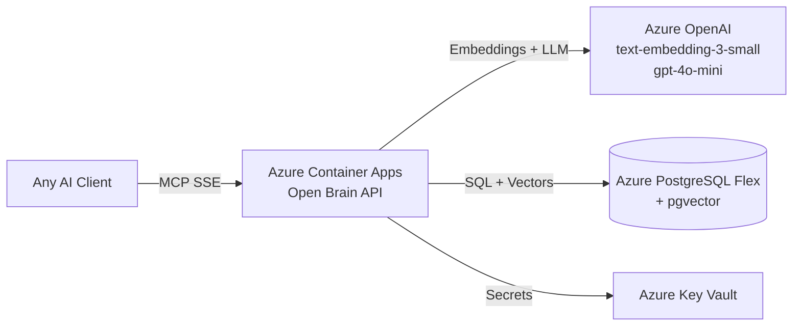

# Open Brain - Azure Deployment

> One-command deployment to Azure using Bicep IaC. Deploys PostgreSQL, Container Apps, Azure OpenAI, and Key Vault.

---

## What You're Building

This guide deploys Open Brain as a fully managed Azure service with no servers to maintain:



| Resource | What It Does | SKU / Tier |
|----------|-------------|-----------|
| **Azure Container Apps** | Runs the Open Brain API (REST + MCP) | Consumption (scale-to-zero) |
| **Azure PostgreSQL Flexible Server** | Stores thoughts + pgvector embeddings | B1ms (burstable, ~$13/month) |
| **Azure OpenAI** | Generates 1536-dim embeddings + metadata extraction | S0 (pay-per-token) |
| **Azure Key Vault** | Stores DB password, MCP key, OpenAI key | Standard |
| **Log Analytics** | Container Apps logging | Per-GB |

### Estimated Cost

| Usage | Monthly Cost |
|-------|-------------|
| **20 thoughts/day** (typical) | ~$15-20/month (PostgreSQL is the main cost) |
| **100 thoughts/day** (heavy) | ~$16-22/month |
| **Scale to zero** (idle) | ~$13/month (PostgreSQL only — Container Apps is free when idle) |

---

## Prerequisites

- **Azure subscription** (free trial works for the first month)
- **Azure CLI** installed ([aka.ms/installazurecli](https://aka.ms/installazurecli))
- **PowerShell 7+** (the deploy script is PowerShell)
- **psql** client (for database initialization) — install via `brew install postgresql` (Mac), `choco install postgresql` (Windows), or `apt install postgresql-client` (Linux)
- ~15 minutes

---

## Deploy (One Command)

The deploy script handles everything — resource group, Bicep deployment, secret generation, database initialization, and health verification.

```powershell
# Clone the repo (if you haven't already)
git clone https://github.com/srnichols/OpenBrain.git
cd OpenBrain

# Deploy to Azure
.\deploy\azure\deploy.ps1 -ResourceGroup rg-openbrain -Location eastus2
```

### What the Script Does

1. Generates a secure database password and MCP access key
2. Creates the resource group
3. Deploys all Azure resources via Bicep (~5-15 minutes)
4. Waits for PostgreSQL to be ready
5. Runs `db/init.sql` (with dimensions adjusted to 1536 for Azure OpenAI)
6. Tests the health endpoint
7. Prints connection info and MCP config

### Parameters

| Parameter | Required | Default | Description |
|-----------|----------|---------|-------------|
| `-ResourceGroup` | Yes | — | Azure resource group name |
| `-Location` | No | `eastus2` | Azure region |
| `-SubscriptionId` | No | Current | Azure subscription ID |
| `-ContainerImage` | No | `ghcr.io/srnichols/openbrain:latest` | Container image to deploy |

### Example with All Parameters

```powershell
.\deploy\azure\deploy.ps1 `
  -ResourceGroup rg-openbrain `
  -Location westus3 `
  -SubscriptionId "12345678-1234-1234-1234-123456789abc" `
  -ContainerImage "ghcr.io/srnichols/openbrain:v1.0.0"
```

---

## After Deployment

The script outputs everything you need:

```
=== Deployment Complete ===

  MCP Endpoint:   https://openbrain-api.niceforest-abc123.eastus2.azurecontainerapps.io/sse
  REST Endpoint:  https://openbrain-api.niceforest-abc123.eastus2.azurecontainerapps.io
  PostgreSQL:     openbrain-pg-abc123.postgres.database.azure.com
  Azure OpenAI:   https://openbrain-ai-abc123.openai.azure.com/
  Key Vault:      openbrain-kv-abc123

MCP Access Key: <your-64-char-hex-key>
```

### Connect Your AI Clients

Use the MCP Endpoint + Key from the output:

**VS Code / GitHub Copilot** (`.vscode/mcp.json`):
```json
{
  "servers": {
    "openbrain": {
      "type": "sse",
      "url": "https://<your-app>.azurecontainerapps.io/sse?key=<YOUR_MCP_KEY>"
    }
  }
}
```

**Claude Code** (`~/.claude/settings.json`):
```json
{
  "mcpServers": {
    "openbrain": {
      "type": "sse",
      "url": "https://<your-app>.azurecontainerapps.io/sse?key=<YOUR_MCP_KEY>"
    }
  }
}
```

**Claude Desktop** (`claude_desktop_config.json`):
```json
{
  "mcpServers": {
    "openbrain": {
      "command": "npx",
      "args": ["-y", "mcp-remote", "https://<your-app>.azurecontainerapps.io/sse?key=<YOUR_MCP_KEY>"]
    }
  }
}
```

See [README — Client Configuration](README.md#client-configuration) for all 9 supported clients.

### Verify

```powershell
# Health check
Invoke-RestMethod -Uri "https://<your-app>.azurecontainerapps.io/health"

# Capture a test thought
Invoke-RestMethod -Uri "https://<your-app>.azurecontainerapps.io/memories" -Method Post `
  -ContentType "application/json" `
  -Body '{"content": "Test thought from Azure deployment. Decision: Azure Container Apps works great."}'

# Search for it
Invoke-RestMethod -Uri "https://<your-app>.azurecontainerapps.io/memories/search" -Method Post `
  -ContentType "application/json" `
  -Body '{"query": "Azure deployment test"}'

# Run the full integration test suite
$env:OPENBRAIN_API_URL = "https://<your-app>.azurecontainerapps.io"
npm run test:integration
```

---

## How It Differs from Other Deployment Paths

| Feature | Docker Compose | K8s On-Prem | **Azure** |
|---------|---------------|-------------|-----------|
| **Embedder** | Ollama (local) | Ollama (local) | **Azure OpenAI** |
| **Dimensions** | 768 | 768 | **1536** |
| **Database** | Local PostgreSQL | K8s StatefulSet | **Azure PostgreSQL Flex** |
| **Scaling** | Manual | K8s HPA | **Auto (scale-to-zero)** |
| **Cost** | $0 (hardware you own) | $0 (hardware you own) | **~$15-20/month** |
| **TLS** | Manual / Tailscale | Tailscale Funnel | **Automatic (Azure)** |
| **Ops** | You manage everything | You manage K8s | **Fully managed** |
| **Best for** | Local dev | Homelab / privacy | **Teams / production** |

---

## Infrastructure Details

### Bicep Template

The Bicep template at `deploy/azure/main.bicep` creates all resources in a single deployment:

| Resource | Azure Type | Notes |
|----------|-----------|-------|
| PostgreSQL | `Microsoft.DBforPostgreSQL/flexibleServers` | v17, pgvector enabled, SSL required |
| Azure OpenAI | `Microsoft.CognitiveServices/accounts` | S0, with `text-embedding-3-small` + `gpt-4o-mini` deployments |
| Container Apps | `Microsoft.App/containerApps` | Scale 0-2 replicas, 0.5 vCPU / 1 GiB RAM |
| Container Apps Environment | `Microsoft.App/managedEnvironments` | With Log Analytics |
| Key Vault | `Microsoft.KeyVault/vaults` | RBAC auth, soft-delete enabled |
| Log Analytics | `Microsoft.OperationalInsights/workspaces` | 30-day retention |

### Environment Variables (auto-configured)

The Container App is automatically configured with:

| Variable | Value | Source |
|----------|-------|--------|
| `EMBEDDER_PROVIDER` | `azure-openai` | Hardcoded in Bicep |
| `EMBEDDING_DIMENSIONS` | `1536` | Azure OpenAI text-embedding-3-small |
| `AZURE_OPENAI_ENDPOINT` | `https://<name>.openai.azure.com/` | From Bicep output |
| `AZURE_OPENAI_KEY` | (secret) | From Key Vault |
| `DB_HOST` | `<name>.postgres.database.azure.com` | From Bicep output |
| `DB_PASSWORD` | (secret) | Generated by deploy script |
| `MCP_ACCESS_KEY` | (secret) | Generated by deploy script |

---

## Troubleshooting

### Container App won't start

```powershell
# Check logs
az containerapp logs show --name openbrain-api --resource-group rg-openbrain --follow

# Check revision status
az containerapp revision list --name openbrain-api --resource-group rg-openbrain -o table
```

### Database connection failures

- Verify the firewall rule allows Azure services: the Bicep template creates an `AllowAzureServices` rule automatically
- Check that pgvector extension is enabled: `az postgres flexible-server parameter show --resource-group rg-openbrain --server-name <pg-server> --name azure.extensions`

### Azure OpenAI quota errors

- Check your quota in the Azure portal: **Azure OpenAI → Your resource → Quotas**
- `text-embedding-3-small` and `gpt-4o-mini` each need deployment capacity
- If you hit limits, request a quota increase via the portal

### Teardown

To delete everything and stop all charges:

```powershell
az group delete --name rg-openbrain --yes --no-wait
```

This deletes all resources in the resource group. Key Vault enters soft-delete (purged after 7 days).
